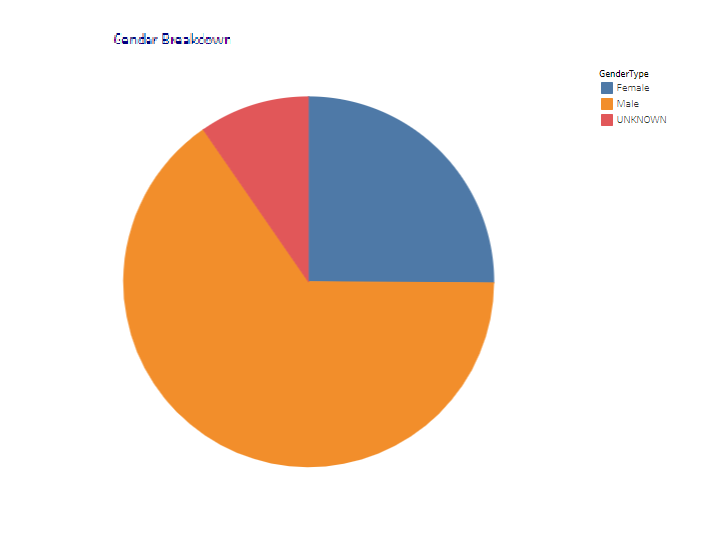
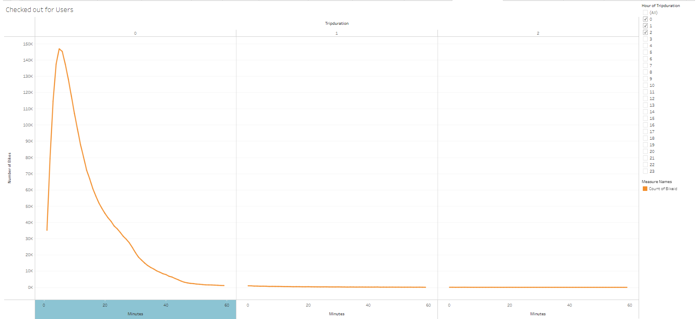
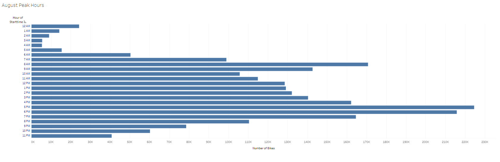
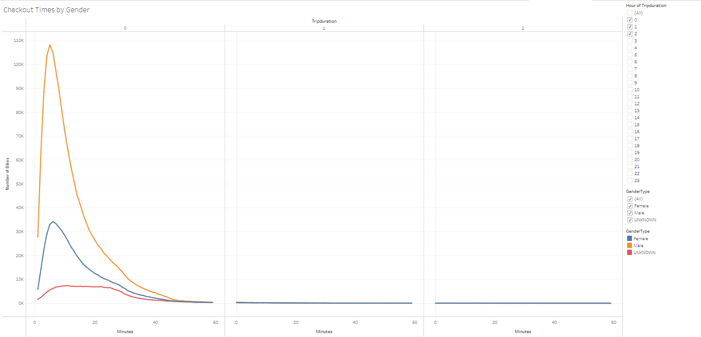
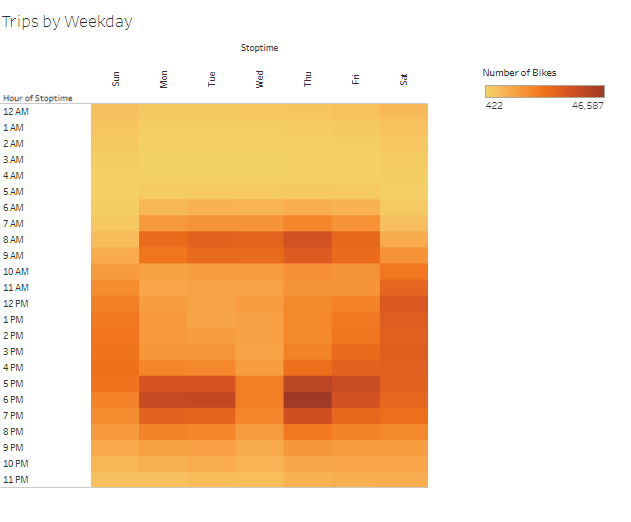
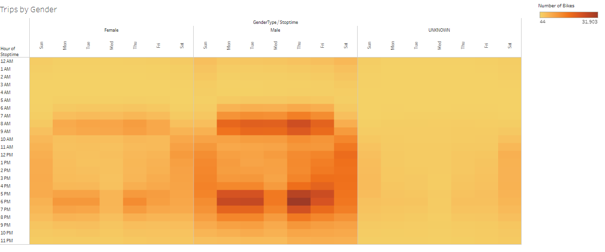
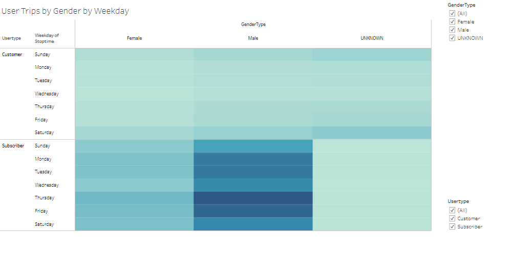
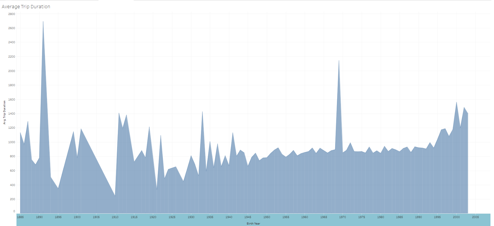

# Bikesharing

## Overview:

The purpose of the analysis is to convince investors that a bike-sharing program in Des Moines is a incredible business idea to explore the city for the users. The analysis shows why bike sharing a good business by answering fundamental questions like who the main customers are, how long bikes are used and when bikes are used the most.  

The link to Tableau dashboard can be found [here](https://public.tableau.com/app/profile/merina.kansakar/viz/BikeSharing_Challenge_16375264145950/NYCBikesStory?publish=yes).

## Results: 
* Approximately 2.3 Millions rides were completed in NYC in August 2019.

 
* Men tend to ride bikes more than women followed by gender unidentified individuals.

 
* Most bikes rides lasted for less than 0 to 20 minutes and 4-7 minutes rides are most popular.

* 8 - 9 AM and 5-6 PM are peak hours for customers checking out. It can be inferred that customers likely used the bikes to commute to/from work to home. 

 
* Men and women tend to ride for shorter duration than unknown gender individuals.

* Per heat map, 8 - 9 AM in the mornings and  between 5-6 PM in the evenings are most busy time for bike rentals during weekdays. During weekends, 11 AM to 6 PM is popular times for bike rentals.

* Men tend to ride most on weekday commute hours (8-9 am and 5-6Pm) and on Saturday late morning to early afternoons. Thursdays are most popular days for men.
Wednesdays are lest populuar days for women.

* Male subscribers tend to ride most on all days of the weeks compared to Male customers. Similarly female subscribers tend to ride more compared to female customers.

* Younger generation population tends to longer with few exception of older population born on year 1969, 1933 and 1891.

## Summary: 
In general bike riders tend to ride during peak commute hours on weekday and during daytime on weekends.  

It is recommended for additional visualizations: 
* Determine age group of male riders on weekdays and weekend.
* Determine age group of female riders on weekdays and weekend.
* Determine most popular route by creating additional data with starting and ending stations.   